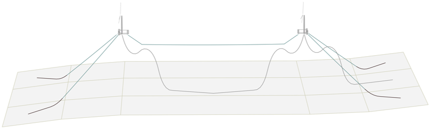

# MoorPy - Quasi-Static Mooring Analysis in Python

MoorPy is an open-source Python library for mooring system modeling. It is 
based around a quasi-static modeling approach and includes a variety of 
design-oriented features to support a variety of application areas.
It is primarily developed at NREL and is part of the 
[WETO Software Stack](https://nrel.github.io/WETOStack). 



More information about MoorPy can be found in the 
[MoorPy documentation](https://moorpy.readthedocs.io).


### Overview

MoorPy is a quasi-static mooring model and a suite of associated functions for mooring 
system analysis. The core model supports quasi-static analysis of moored floating systems 
including any arrangement of mooring lines and floating platforms. It solves the distributed 
position and tension of each mooring line segment using standard catenary equations. 
Floating platforms can be represented with linear hydrostatic characteristics. MoorPy 
automatically computes a floating system's equilibrium state and can be queried to identify 
a mooring system's nonlinear force-displacement relationships. Linearized stiffness matrices 
are efficiently computed using semi-analytic Jacobians. MoorPy also includes plotting 
functions and a library of mooring component property and cost coefficients. 

MoorPy also contains reference property coefficients and utility functions for 
common mooring line materials and anchor types. These data and functions help
with setting appropriate mechanical and cost characteristics for mooring 
components that are then modeled in MoorPy.

MoorPy can be used directly from Python scripts to perform mooring design 
and modeling tasks, or it can be coupled with other tools to compute 
quasi-static mooring reactions as part of a larger simulation. For example, 
MoorPy is used in the frequency-domain floating system simulator 
[RAFT](https://github.com/WISDEM/RAFT).


### Prerequisites

- Python 3.9 or greater
- The following packages: NumPy, MatPlotLib, pyyaml, scipy

### Installation

MoorPy is available on PyPi via:
```pycon
pip install MoorPy
```

For an editable install that relies on the local source code, first clone the repository.  Then, from the command line in the main MoorPy directory, run the following commands (with a "-e" for "editable") based on your additional needs.
The "dev", "test", and "docs" flags will install necessary packages related to development, testing, or documentation (e.g., the docs flag installs "sphinx" for documentation).

#### General
```pycon
pip install .
```

#### Development
```pycon
pip install .[dev]
```
#### Testing
```pycon
pip install .[test]
pre-commit install --hook-type pre-commit --hook-type pre-push
```
#### Documentation
```pycon
pip install .[docs]
```


### Citing

The MoorPy software can be cited as:
M. Hall, S. Housner, S. Sirnivas, and S. Wilson.
*MoorPy: Quasi-Static Mooring Analysis in Python.*
National Renewable Energy Laboratory, 2021.
https://doi.org/10.11578/dc.20210726.1.

Papers describing the theory behind MoorPy are listed in the
[MoorPy documentation](https://moorpy.readthedocs.io).